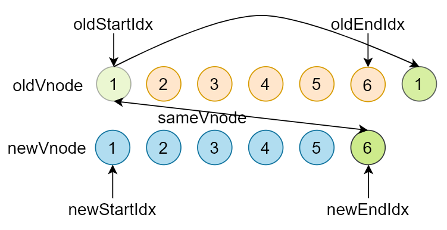
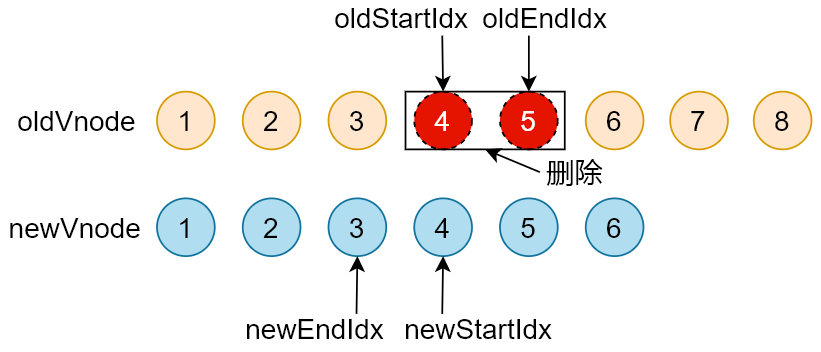

## Snabbdom的核心
- init()设置模块，创建patch()函数
- 使用h()函数创建javascript对象(VNode)描述真实DOM
- patch()比较新旧两个VNode
- 把变化的内容更新到真实DOM树

## VNode

- 一个VNode就是一个虚拟节点用来描述一个DOM元素，如果这个VNode有children，children也是VNode

```tsx
export interface VNode {
  // 选择器
  sel: string | undefined;
  // 节点数据：属性/样式/事件等
  data: VNodeData | undefined;
  // 子节点，和 text 只能互斥
  children: Array<VNode | string> | undefined;
  // 记录 vnode 对应的真实 DOM
  elm: Node | undefined;
  // 节点中的文本内容，和 children 只能互斥
  text: string | undefined;
  // 唯一标识VNode，优化用
  key: Key | undefined;
}
export function vnode (sel: string | undefined,
                      data: any | undefined,
                      children: Array<VNode | string> | undefined,
                      text: string | undefined,
                      elm: Element | Text | undefined): VNode {
  const key = data === undefined ? undefined : data.key
  return { sel, data, children, text, elm, key }
}
```

## patch整体过程分析

- patch(oldVnode, newVnode)
- 打补丁，把新节点中变化的内容渲染到真实 DOM，最后返回新节点作为下一次处理的旧节点
- 对比新旧 VNode 是否相同节点(节点的 key 和 sel 相同)
- 如果不是相同节点，删除之前的内容，重新渲染
- 如果是相同节点，再判断新的 VNode 是否有 text，如果有并且和 oldVnode 的 text 不同，直接更新文本内容
- 如果新的 VNode 有 children，判断子节点是否有变化，判断子节点的过程使用的就是 diff 算法
- diff 过程只进行同层级比较

## init

- 功能：init(modules, domApi)，返回patch()函数(高阶函数)
- 为什么使用高阶函数
  - 因为 patch() 函数再外部会调用多次，每次调用依赖一些参数，比如：modules/domApi/cbs
  - 通过高阶函数让 init() 内部形成闭包，返回的 patch() 可以访问到 modules/domApi/cbs，而不需要重新创建，这也叫函数的柯里化
  - init() 在返回 patch() 之前，首先收集了所有模块中的钩子函数存储到 cbs 对象中

## patch

- 功能
  - 传入新旧VNode，对比差异，把差异渲染到DOM
  - 返回新的VNode，作为下一次patch()和oldVnode
- 执行过程
  - 首先执行模块中的钩子函数`pre`
  - 如果oldVnode是DOM元素
    - 把DOM元素转换为oldVnode
  - 如果oldVnode和vnode相同(key和sel相同)
    - 调用patchVnode()，找节点的差异并更新DOM，这是diff算法的核心
  - 如果oldVnode和vnode不相同
    - 调用createElm()把vnode转换为真实DOM，记录到vnode.elm中
    - 把刚创建的DOM元素插入到parent中
    - 移除旧的DOM节点
    - 触发用户设置的`create`钩子函数

## createElm

- 功能
  - createElm(vnode, insertedVnodeQueue)，返回创建的DOM元素
  - 创建vnode对应的DOM元素，添加到vnode的elm属性中
- 执行过程
  - 首先触发用户设置的`init`钩子函数
  - 如果选择器是!，创建评论节点
  - 如果选择器为空，创建文本节点
  - 如果选择器不为空
    - 解析选择器，创建标签，设置标签的id和class属性
    - 执行**模块**的`create`钩子函数
    - 如果vnode有children，创建子vnode对应的DOM，追加到DOM树
    - 如果vnode的text值是string/number，创建文本节点并追加到DOM树
    - 执行**用户**设置的`create`钩子函数
    - 如果用户设置了`insert`钩子函数，把vnode添加到insertedVnodeQueue队列中，在插入父节点中再执行

## patchVnode

- 功能
  - patchVnode(oldVnode, vnode, insertedVnodeQueue)
  - 对比oldVnode和vnode的差异，将差异渲染到DOM
- 执行过程
  - 首先执行**用户**设置的`prepatch`钩子函数
  - 执行create钩子函数
    - 首先执行**模块**的`update`钩子函数
    - 然后执行**用户**的`update`钩子函数(因为用户可能会进行其他操作)
  - 如果**vnode.text**未定义
    - 如果`vnode.children`和`oldvnode.children`都有值
      - 调用`updateChildren()`
      - 使用diff算法对比子节点，更新子节点
    - 如果`vnode.children`有值，`oldvnode.children`无值
      - 如果老节点有text属性，清空DOM元素的textContent
      - 调用addVnode()，批量添加子节点
    - 如果`vnode.children`无值，`oldvnode.children`有值
      - 调用`removeVnodes()`，批量移除子节点
    - 如果`oldVnode.text`有值
      - 清空DOM元素的textContent
  - 如果设置了**vnode.text**并且和**oldVnode.text**不等
    - 如果老节点有子节点，全部移除
    - 设置DOM元素的`textContent`为`vnode.text`
  - 执行**用户**设置的`postpatch`钩子函数

## updateChildren

- 功能

  - diff算法的核心，对比新旧节点的children，更新DOM

- 执行过程

  - 将两颗树中所有的节点一一对比需要O(n²)的复杂度，在对比过程中发现旧节点在新的树中未找到，那么就需要把旧节点删除，删除一棵树的一个节点(找到一个合适的节点放到被删除的位置)的[时间复杂度为O(n),同理添加新节点的复杂度也是O(n),合起来diff两个树的复杂度就是O(n³)
  - 在DOM 操作的时候我们很少很少会把一个父节点移动/更新到某一个子节点
  - 因此只需要找**同级别**的子**节点**依次**比较**，然后再找下一级别的节点比较，这样算法的时间复杂度为 O(n)

  

  - 在进行同级别节点比较的时候，首先会对新老节点数组的开始和结尾节点设置标记索引，遍历的过程中移动索引

  - 在对**开始和结束节点**比较的时候，总共有四种情况

    - oldStartVnode / newStartVnode (旧开始节点 / 新开始节点)
    - oldEndVnode / newEndVnode (旧结束节点 / 新结束节点)
    - oldStartVnode / oldEndVnode (旧开始节点 / 新结束节点)
    - oldEndVnode / newStartVnode (旧结束节点 / 新开始节点)

    

  - 旧开始节点和新开始节点比较，旧结束节点和新结束节点比较，这两种情况类似，只分析一种

  - 情况一，二：如果oldStartVnode和newStartVnode是sameVnode(key和sel相同)

    - 调用 patchVnode() 对比和更新节点
    - 把旧开始和新开始索引往后移动  oldStartIdx++ / oldStartIdx++

    

  - 情况三：oldStartVnode / newEndVnode (旧开始节点 / 新结束节点) 相同

    - 调用 patchVnode() 对比和更新节点
    - 把 oldStartVnode 对应的 DOM 元素，移动到右边
    - 更新索引

    

  - 情况四：oldEndVnode / newStartVnode (旧结束节点 / 新开始节点) 相同

    - 调用 patchVnode() 对比和更新节点
     - 把 oldEndVnode 对应的 DOM 元素，移动到左边
     - 更新索引

    

  - 如果不是上面四种情况

    - 遍历新节点，使用 newStartNode 的 key 在老节点数组中找相同节点
    - 如果没有找到，说明 newStartNode 是新节点
      - 创建新节点对应的 DOM 元素，插入到 DOM 树中
    - 如果找到了
      - 判断新节点和找到的老节点的 sel 选择器是否相同
      - 如果不相同，说明节点被修改了
        - 重新创建对应的 DOM 元素，插入到 DOM 树中
      - 如果相同，把 elmToMove 对应的 DOM 元素，移动到左边

    

  - 循环结束

    - 如果老节点的数组先遍历完(oldStartIdx > oldEndIdx)，说明新节点有剩余，把剩余节点批量插入到右边

    

    - 如果新节点的数组先遍历完(newStartIdx > newEndIdx)，说明老节点有剩余，把剩余节点批量删除

    

- key值的作用

  - 在新旧节点对比中，会首先通过sameVnode比较两个节点是否相同(判断key和sel是否相同)
  - 如果不设置key，sel相同就会被认为是相同节点，则会最大程度复用相同的元素，只对子节点进行替换
    - 可能会出现状态出错的问题，如删除一个被选中的checkbox，后面的元素会复用这个被删除的元素，patch更新后依旧会被选中
    - 如果只是移动了位置，对于每个节点的内容基本都需要进行修改
  - 设置了key，只有在key和sel都相同的情况下才会复用旧节点
    - 不会出现状态出错的问题
    - 如果只是移动了位置，在diff算法中只需要移动位置就可实现更新，不需要更新元素的操作

